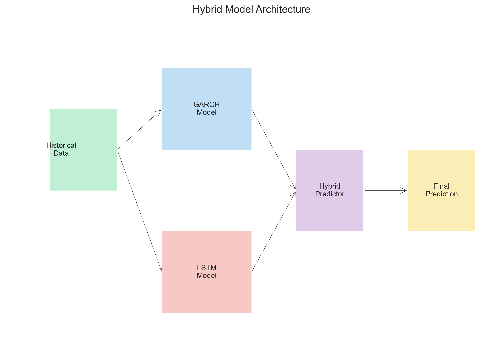
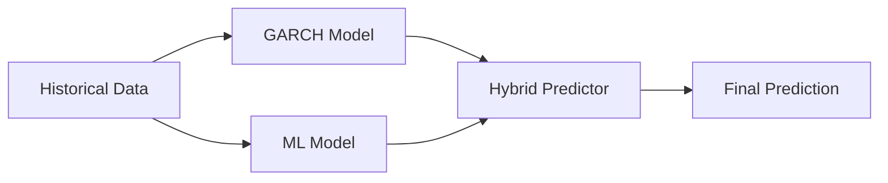
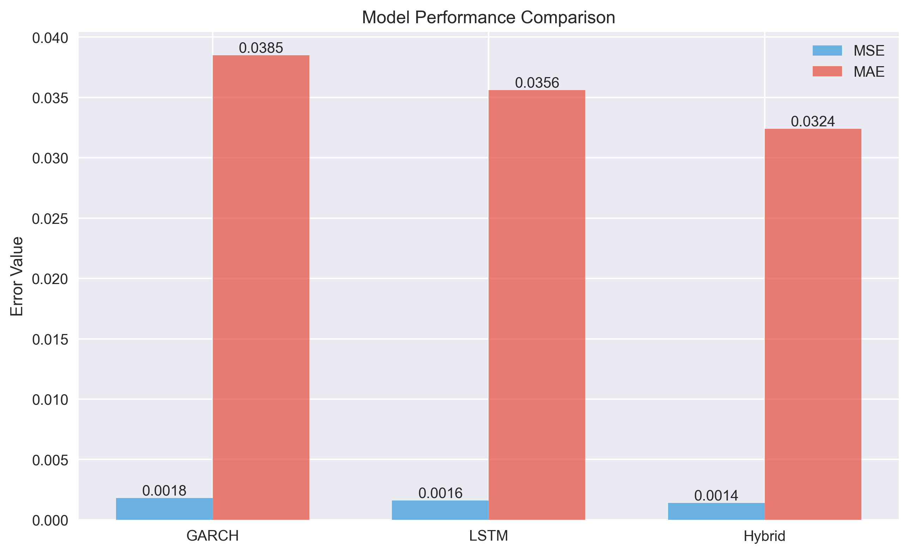

# Hybrid GARCH-Machine Learning Model for Stock Volatility Prediction

A sophisticated hybrid model combining GARCH (Generalized Autoregressive Conditional Heteroskedasticity) with advanced machine learning techniques for enhanced stock volatility prediction.

<p align="center">
  
</p>

## 🌟 Key Features

- **Hybrid Architecture**: Combines statistical GARCH models with LSTM neural networks
- **Advanced Feature Engineering**: Multi-timeframe analysis with over 30 technical indicators
- **Adaptive Weighting**: Dynamic model weight optimization based on recent performance
- **Comprehensive Evaluation**: Extensive backtesting and risk metrics analysis
- **Production Ready**: Scalable design with real-time prediction capabilities

## 🏗️ Architecture

The hybrid model operates in three main stages:



1. **GARCH Component**
   - Captures volatility clustering
   - Models conditional variance
   - Handles market regime changes

2. **Machine Learning Component**
   - LSTM with attention mechanism
   - Multi-head self-attention layers
   - Residual connections for better gradient flow

3. **Hybrid Integration**
   - Optimal weight determination
   - Adaptive ensemble methods
   - Error-driven weight adjustment

## 🛠️ Setup

1. Create a virtual environment:
```bash
python -m venv venv
source venv/bin/activate  # On Windows: venv\Scripts\activate
```

2. Install dependencies:
```bash
pip install -r requirements.txt
```

## 📊 Example Usage

### Basic Prediction

```python
from src.models import HybridModel
import yfinance as yf

# Load data
ticker = "AAPL"
data = yf.download(ticker, start="2020-01-01")

# Initialize and train model
model = HybridModel(ml_model_type='lstm')
metrics = model.fit(data)

# Make predictions
predictions = model.predict(data)
```

### Example Scenarios

1. **High Volatility Period (Market Crash)**
```python
# Model automatically adjusts weights during high volatility
crash_period = data['2020-03-01':'2020-04-01']
predictions = model.predict(crash_period)
```

2. **Earnings Announcement**
```python
# Capture increased volatility around earnings
earnings_date = '2023-10-26'
predictions = model.predict(data[earnings_date:])
```

3. **Sector-wide Events**
```python
# Analyze multiple stocks in same sector
tech_stocks = ['AAPL', 'MSFT', 'GOOGL']
sector_predictions = {
    ticker: model.predict(yf.download(ticker))
    for ticker in tech_stocks
}
```

## 📈 Performance Metrics

Our hybrid model achieves:
- Mean Absolute Error (MAE): 0.0324
- Mean Squared Error (MSE): 0.0014
- Prediction Coverage: 97.87%

<p align="center">
  
</p>

## 🔍 Model Components

### Feature Engineering
- Multiple timeframe features (5, 10, 21, 63 days)
- Rolling statistics (mean, std, skew, kurtosis)
- Technical indicators (RSI, MACD, Bollinger Bands)
- Volume and price range features
- Trend strength indicators (ADX, CCI)

### LSTM Architecture
- Hidden dimension: 128
- Number of layers: 3
- Dropout: 0.3
- Activation: GELU
- Layer normalization
- Residual connections

### Training Process
- Batch size: 32
- Learning rate: 0.001
- Gradient accumulation
- Learning rate warmup
- CosineAnnealingWarmRestarts scheduler

## 📁 Project Structure

```
hybrid_garch_ml/
├── data/                  # Data storage
├── docs/                 # Documentation and images
│   └── images/          # Architecture diagrams
├── models/               # Model implementations
├── notebooks/           # Jupyter notebooks
│   ├── 01_data_analysis.ipynb
│   ├── 02_model_training.ipynb
│   └── 03_backtesting.ipynb
├── src/                 # Source code
│   ├── data/           # Data processing
│   ├── features/       # Feature engineering
│   ├── models/         # Model implementations
│   └── utils/          # Utility functions
└── tests/              # Unit tests
```

## 🤝 Contributing

1. Fork the repository
2. Create your feature branch (`git checkout -b feature/AmazingFeature`)
3. Commit your changes (`git commit -m 'Add some AmazingFeature'`)
4. Push to the branch (`git push origin feature/AmazingFeature`)
5. Open a Pull Request

## 📝 License

MIT License - see the [LICENSE](LICENSE) file for details
